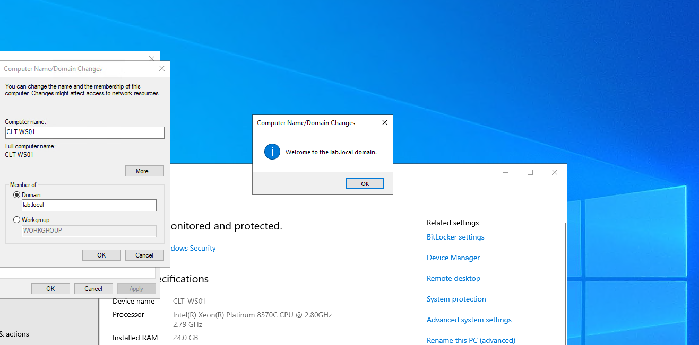
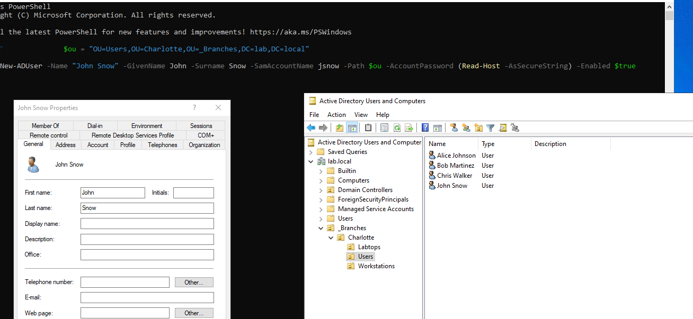
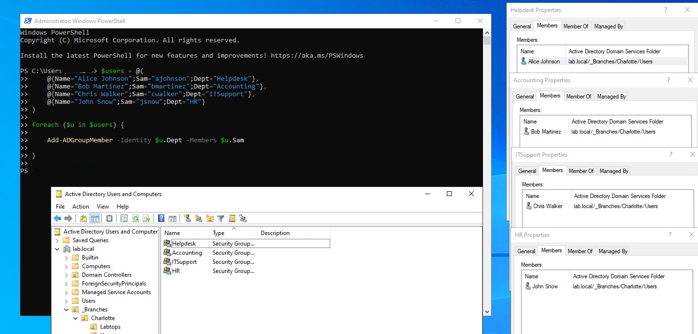
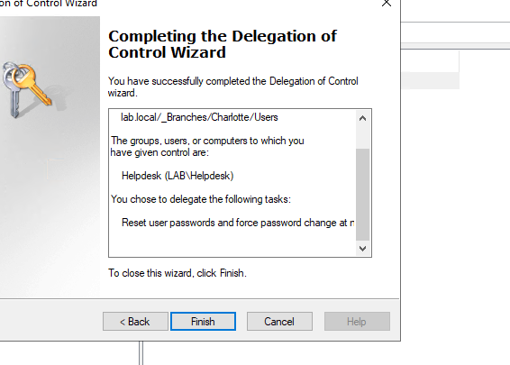
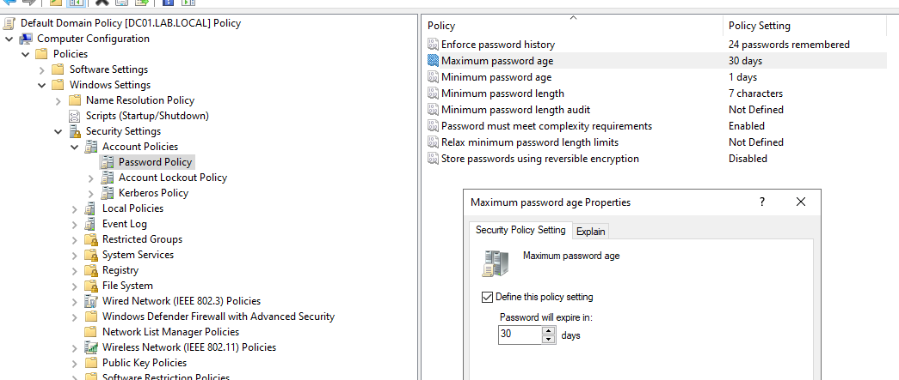
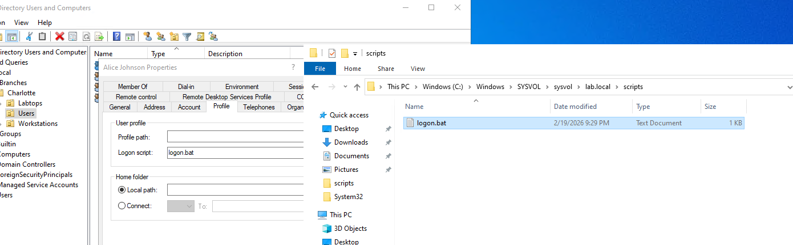
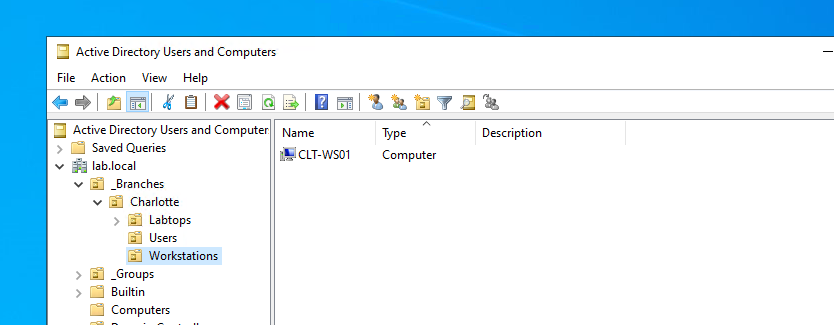
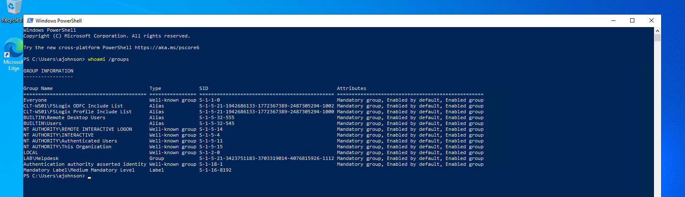

# Hybrid Active Directory Lab (Azure)

## Overview

This project documents the deployment of a hybrid Active Directory environment in Microsoft Azure and the operational tasks performed within it.
The objective is to understand how identity, authentication, authorization, and delegated administration operate inside a centralized domain.

This environment serves as the foundation for future identity monitoring and detection engineering exercises.

---

## Attribution

This lab was inspired by an Active Directory deployment guide by
[Jake Hulberg](https://www.jakehulberg.dev/).

I followed the core infrastructure setup and then extended the environment with additional administrative and operational tasks to better understand how Active Directory is used in real enterprise environments.

All implementation steps, troubleshooting, validation, and documentation in this repository reflect my own execution and learning process.

---

## Environment Architecture

* Windows Server 2022 Domain Controller
* Windows 10 Enterprise domain workstation
* Azure Virtual Network with segmented subnets
* Organizational Units structured by department

---

## Identity Administration Tasks Performed

* Domain join and authentication validation
* PowerShell-based user provisioning
* Security group assignment
* Remote Desktop authorization configuration
* Helpdesk password reset delegation
* Domain password policy configuration
* Logon script deployment via SYSVOL

---

## Key Concepts Practiced

* Authentication vs Authorization
* Role-based access control
* Delegated administration
* Policy enforcement via Group Policy
* Centralized identity management

---

## Implementation Evidence

### Domain Integration

The workstation successfully joined the domain and authenticated using centralized identity services.

---

### Automated Identity Provisioning

Users were created and assigned groups using PowerShell to simulate repeatable administrative workflows.

---

### Delegated Administration

Helpdesk users were granted limited administrative privileges (password reset) without domain administrator rights.

---

### Policy Enforcement

Domain password policies and logon scripts were delivered through Group Policy and SYSVOL.

---

### Organizational Structure

The workstation was placed into a departmental OU to allow scoped policy application.

---

### Authentication Context Validation

The user session confirms domain group membership is applied at logon.

---

## Next Phase

This environment will now be expanded into a security-focused lab used to simulate identity-based attack scenarios and build detection logic around authentication and authorization events.
